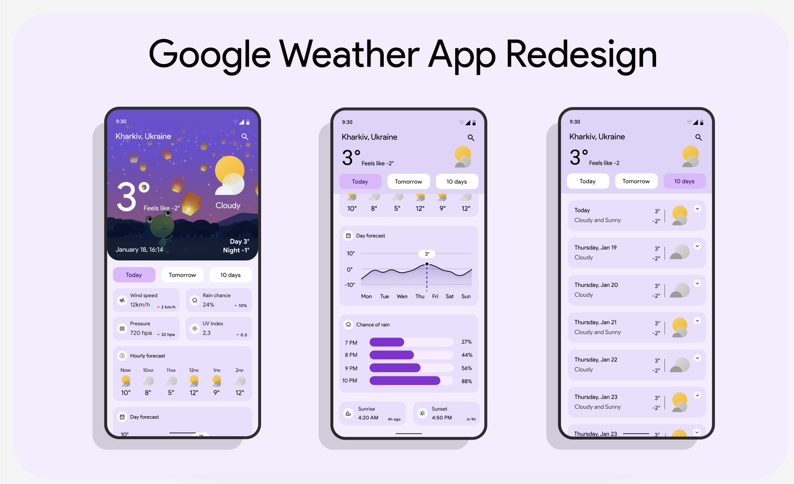

# tenten

A weather application

## Preview



## Getting started

#### Get country api
Login to website to key api key: https://api-ninjas.com

#### Get weather api
Login to website to get api key: https://openweathermap.com

#### Run project
1. Get dependencies:
```
flutter pub get
```

2. List devices connected
```
fltuter devices
```

3. Run flutter to specify device
```
flutter run -d {device_id}
```
